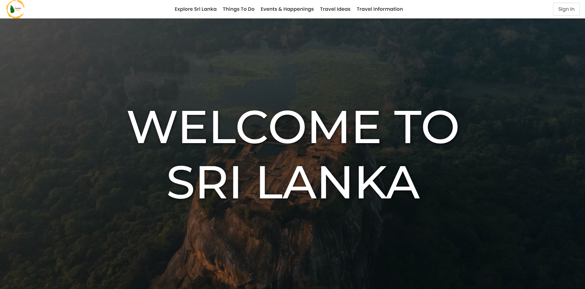
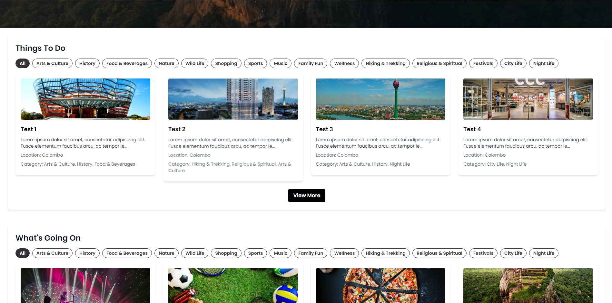
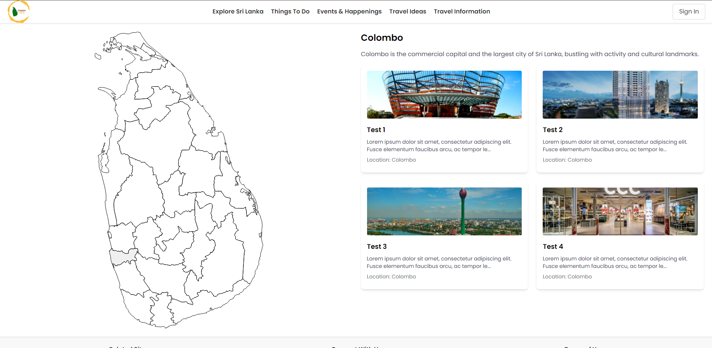
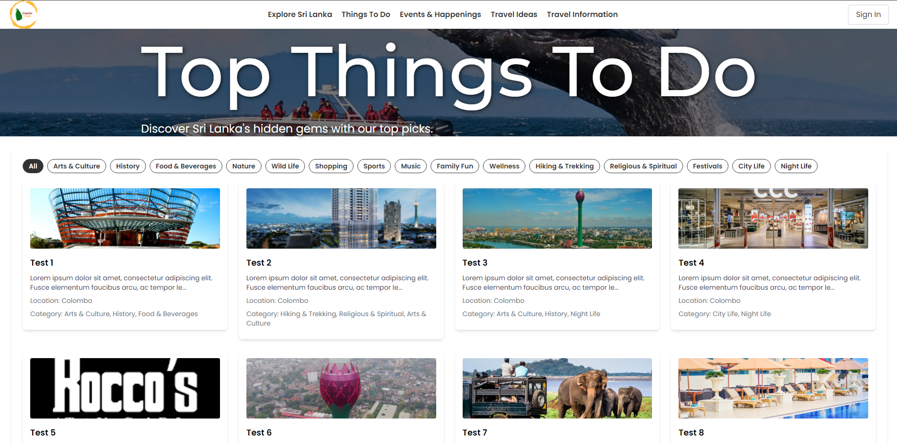
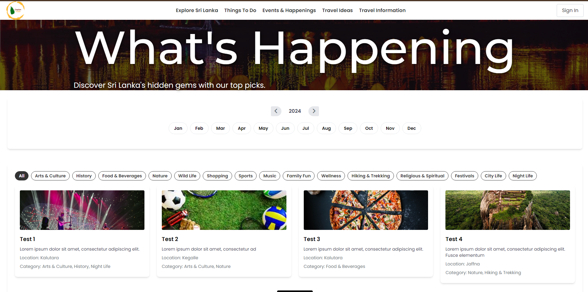
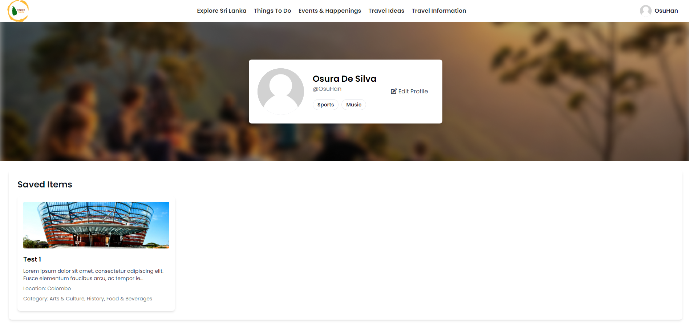
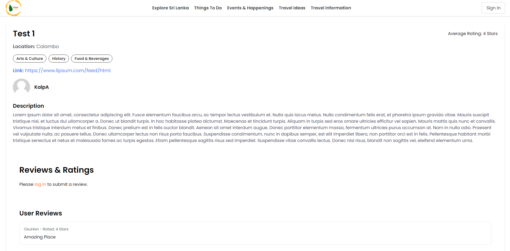
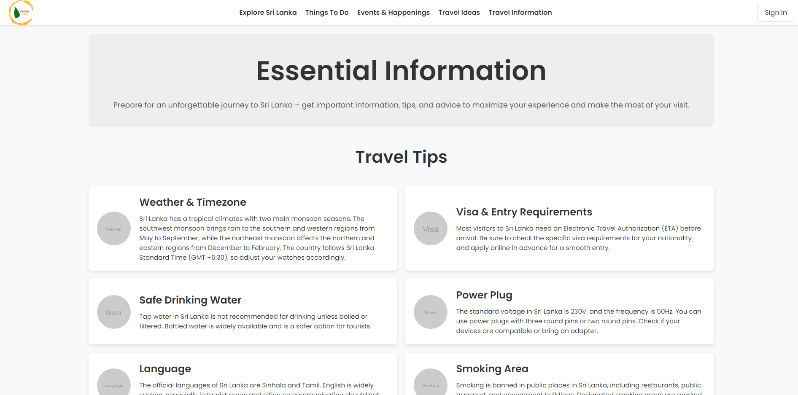
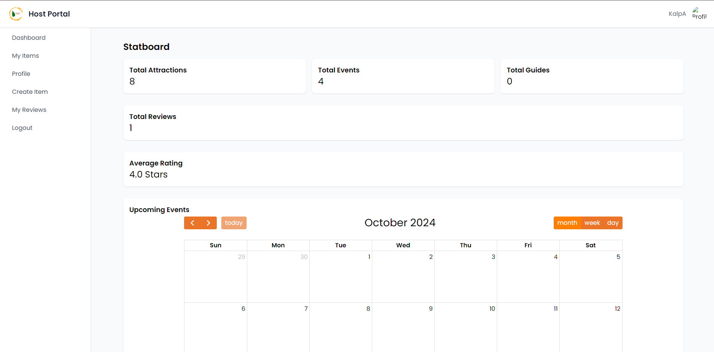
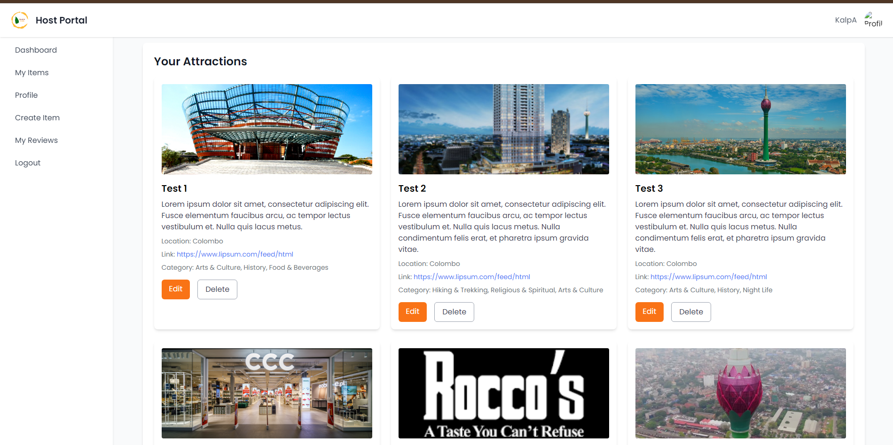

<h1 align="center" style="font-family: 'Orbitron', sans-serif;">Ceylon Trails</h1>

<p align="justify">
  Ceylon Trails is a dynamic tourism platform designed to assist travelers in exploring the beautiful island of Sri Lanka. The platform offers a variety of features aimed at enhancing the user experience, from discovering attractions and events to creating custom itineraries and saving favorite places. Built using the TALL stack (Tailwind CSS, Alpine.js, Laravel, Livewire), Ceylon Trails offers both tourists and hosts an intuitive and engaging interface.
</p>

---

## Key Features

### 1. **Custom Interactive Map of Sri Lanka**
One of the standout features of **Ceylon Trails** is the **custom-built interactive map**. Manually crafted to showcase each district in Sri Lanka, this map allows users to:
- **Hover** over districts to highlight them.
- **Click** on districts to view the top attractions, events, and places to visit in that region.
- **Filter results** dynamically based on the district selected, providing real-time updates of content.
  
The map is entirely custom-made using SVG (Scalable Vector Graphics), enabling smooth interaction and responsiveness across devices. This manual implementation ensures a lightweight and fast experience for users exploring Sri Lanka.

### 2. **Tourist and Host Registration**
- **Tourist users** can register, save favorite places, and create personalized itineraries.
- **Host users** have a separate registration process, allowing them to list attractions, events, and more, which can be managed via a custom-built host dashboard.

### 3. **Explore Page**
- An easy-to-navigate page showcasing the best attractions, categorized by things to do, places to visit, and upcoming events.
- The explore page integrates seamlessly with the interactive map, giving users a visual and hands-on way to discover the island.

### 4. **Dynamic Content**
- Both tourists and hosts can view content that is dynamically loaded based on their preferences and interactions with the platform.
- Filtering by category, region, or attraction type is possible without refreshing the page.


---

## Tech Stack

- **Backend**: [Laravel 11](https://laravel.com/)
- **Frontend**: Blade, Tailwind CSS, Alpine.js
- **Database**: MySQL
- **Tools**: Jetstream, Livewire, Laravel Forge
- **Hosting**: Project was hosted using Laravel Forge, for testing purposes.
- **Testing**: Cypress, Ghost Inspector

---

## Screenshots

### Homepage



### Explore Page


### Things to Do Page


### Events & Happenings Page


### Profile Page


### Attraction Details Page


### Travel Info Page


### Host Dashboard


### Host Dashboard Items



---

## Installation

```bash
git clone [https://github.com/OsuraHansaja/Ceylon-Trails]
cd Ceylon-Trails
composer install
npm install
cp .env.example .env
php artisan key:generate
php artisan migrate --seed
npm run dev
php artisan serve
